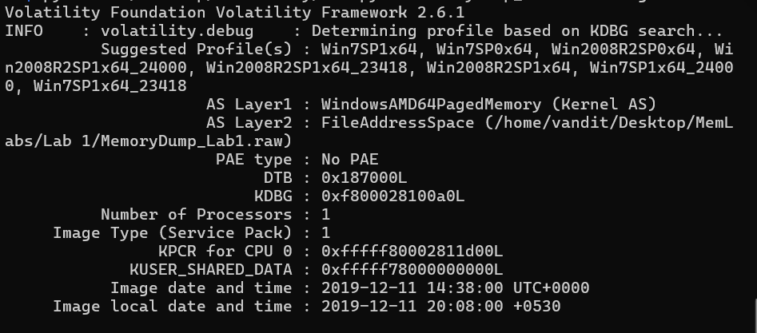
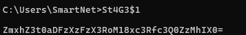
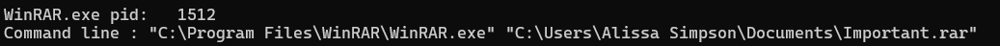
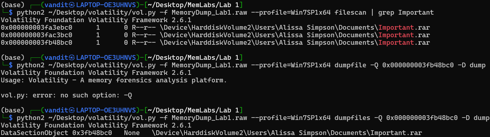
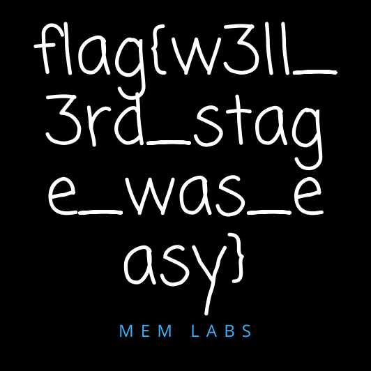

## Mem Labs 1
After downloading and unziping the download, we obtain MemoryDemp_Lab1.raw
Using Volatility (Python2) and opening the imageinfo we obtain the prfile "Win7SP1x64".

After that checking the processes list and the question promp, we knew we had to do something with both command promt and mspaint.
Also checking the console for any output, we obtained the first flag.

Decoding the flag from base64 we get : flag{th1s_1s_th3_1st_st4g3!!}
Now, moving onto ms paint. I figured if the application was running, there should be some files it accessed, to view them i Used the `memdump` plugin (also 2424 is the processid of mspaint):
`$ python2 ~/Desktop/volatility/vol.py -f MemoryDump_Lab1.raw --profile=Win7SP1x64 memdump -p 2424 -D dump` 
This gave me a 2424.dmp file, which I did not know what to do with. After googling online regarding both the filetype as well as the Lab solution (I did have to look at the solutions for this part), we had to open it in Gimp.
Not sure why, but I could not access GIMP / open this file in any way. So, I could not open the file successfully and thus this flag was not achieved by me.
Next using the cmdline plugin, i found this...

This showed me that this Important.rar file must be relevent. 
Then I using google, i found the filescan plugin in combination with the dumpfiles plugin to extract the pirticular file as.

Opening the rar file, it required the NTML has of Alissa Simpson account, which could be found with the hashdump plugin.
After successfully opeing the file, we found the last flag.

