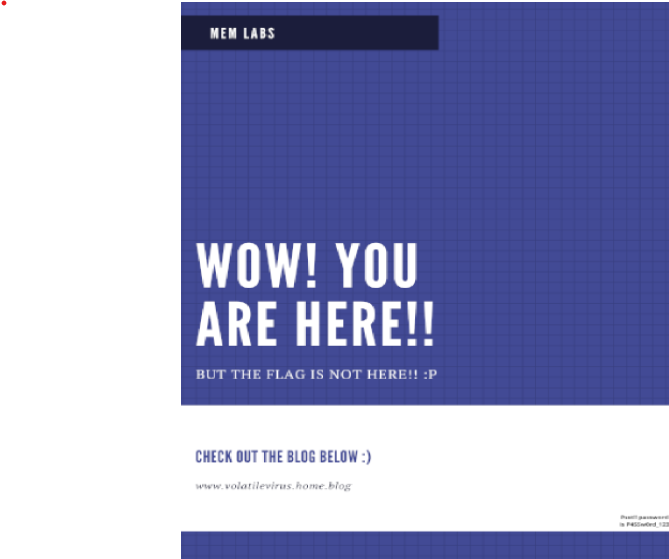
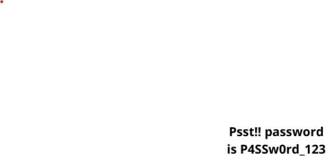
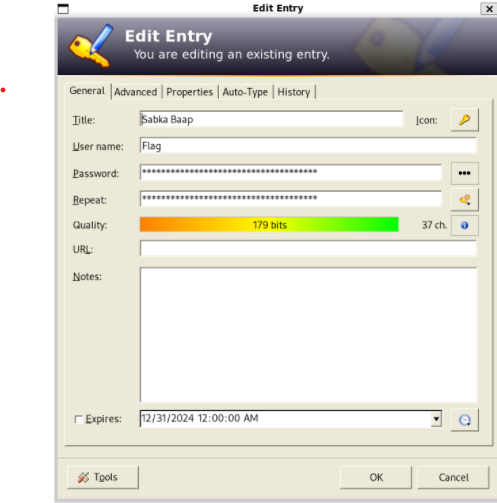
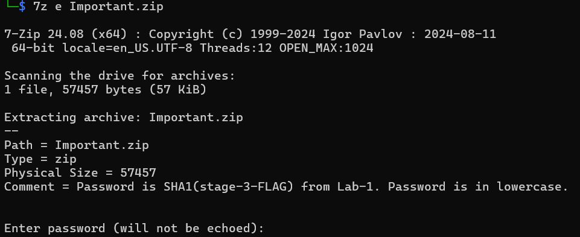
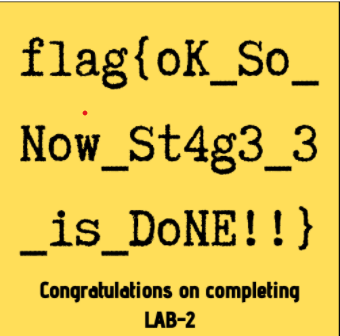

## Memlabs Lab 2

After reading the question prompt, I understood the flags would revolve around Environment Variables, A password manager and a web browser. 
Running 'imageinfo' plugin on the memory dump gave me the profile required;
First using pslist: I found 2 programs worth noting.
1. chrome.exe
2. KeePass.exe
after googling, found that KeePass was a password manager.
Now using `$ python2 ~/Desktop/volatility/vol.py -f MemoryDump_Lab2.raw --profile=Win7SP1x64 envars | grep chrome ` (environment variables)
I found a weird file location : C:\Windows\ZmxhZ3t3M2xjMG0zX1QwXyRUNGczXyFfT2ZfTDRCXzJ9
Using Base64 on it gave me the first flag : flag{w3lc0m3_T0_$T4g3_!_L4B_2}
Next, using
`$ python2 ~/Desktop/volatility/vol.py -f MemoryDump_Lab2.raw --profile=Win7SP1x64 filescan | grep Password `, I found a .png file.
Using dumpfiles (use -Q (offset)), I saved the Png opening which gave me:

I kept this password, must be usefull in the future.
Then using:
`$ python2 ~/Desktop/volatility/vol.py -f ~/Desktop/MemLabs/Lab\ 2/MemoryDump_Lab2.raw --profile=Win7SP1x64 filescan | grep Secrets`
Showed me a hidden.kdb file, which is the file storage format of KeePass.
Using 'dumpfiles', i extracted it and opened it using KeePass2.
It seemed the passwords were useless, but the recycle bin had the second flag : 

Now onto google chrome
first using handles to view history, used "history" as filter first, then used "History" to get the files (learned this on yt) Channel : DFIR science.
did not get any success, searched on google on how to access it and found a plugin for the same.
using the plugin I found that the user access a Mega file site, going to which have me a zip file.
Opening the zip file, we obtain a 7z file which required the flag 3 of lab1 encoded in sha1.

Doing that we got the final flag: 

